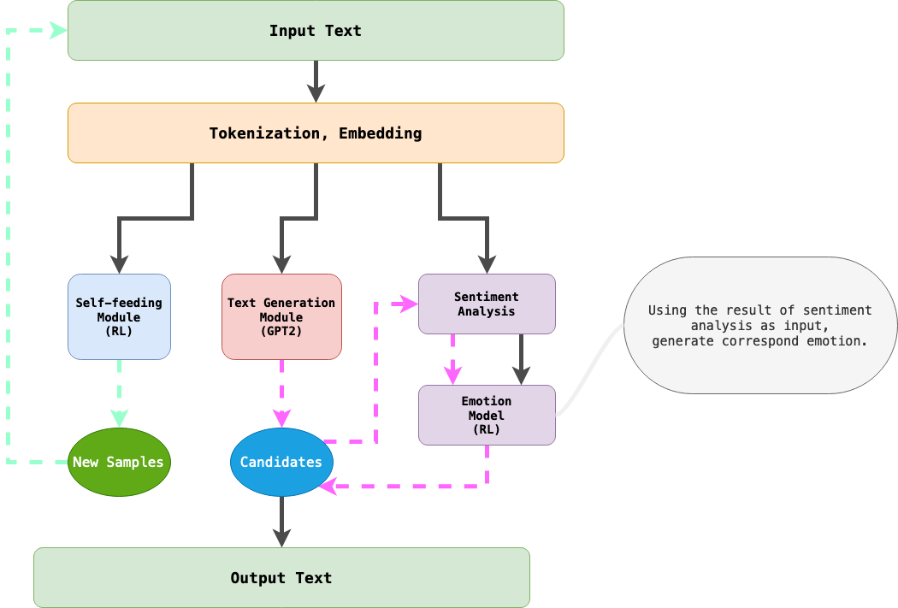

# chat bot

> 中央大學專題實驗

## 目標：透過深度強化學習建構可用的助理 chat bot

1. 建構實際能使用的模型、部署程序和操作介面
2. 使用 GPT 訓練模型
3. （未定）

## 使用技術

- chat bot
    - 模型
        - [CHAI: A CHatbot AI for Task-Oriented Dialogue with Offline Reinforcement Learning](https://paperswithcode.com/paper/chai-a-chatbot-ai-for-task-oriented-dialogue)
        - [Learning from Dialogue after Deployment: Feed Yourself, Chatbot!](https://paperswithcode.com/paper/learning-from-dialogue-after-deployment-feed)
    - 模型建構：PyTorch 2、PyTorch Lightning、Trl
    - 模型訓練：GPT-2
    - 模型部署：torchserve
- 互動前端
    - Vue

## 模型架構

## 實驗階段

### Stage 0.

- 建構文字生成模組

### Stage 1.

- 建構 Self-feeding 模組

### Stage 2. (Temp Final)

- 建構情感模組

## 參考資料
1. [Deep Reinforcement Learning for Dialogue Generation](https://paperswithcode.com/paper/deep-reinforcement-learning-for-dialogue)
