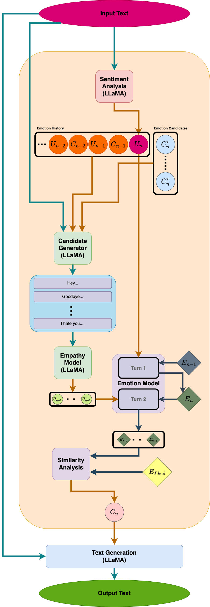

# 帶有情緒模組的聊天機器人之實作

> 中央大學專題實驗

## 目標

1. 新增額外的情感模組，使模型能以類似人類的方式處理情緒

2. 使模型能具有自己的情感或近似的狀態

## 使用技術

- Python >3.11

- PyTorch 2

- Peft（LoRA）

- Trl

- Unsloth

## 模型架構

### 整體架構

#### 構想

設定一情緒表徵作為模型自身情緒上最理想的狀態，則情緒模組之目的是使自身目前的情緒表徵盡可能相似於理想的表徵。
由於情緒表徵隨時持續受使用者輸入影響，應不可能達成與理想表徵完全一致的狀態，
因此透過情緒模組在產生回應情緒上的不確定性，預期能達成近似於模型自身具有感情的效果。

#### 機制

模組本身會執行三大步驟，依序為辨識情緒、處理情緒、產生情緒。

- [**辨識情緒**](src/model/docs/README_SA.md)

  此步驟直接使用 Daily Dialog 資料集來微調 LLM 進行 Sentimental Analysis，
  對輸入的語句進行分析後回傳在 Daily Dialog 資料集中使用的 7 種基本情緒的文字型態標籤（ $U_n$ ），後續在模組中直接使用。

- **處理情緒** 

  此處分為兩個子模組進行處理，同理心子模組（Empathy Model）與情緒子模組（Emotion Model）。
  分為兩個模組的目的是為了讓模型以類似人類的方式應對情緒，情緒刺激會對人類有長期和短期的影響，而人類也會同理對方情緒作為應對的考量。

  - [_同理心子模組（Empathy Model）_](src/model/docs/README_EP.md)

    考量到人類在同理他人時也會參考先前的應對作為參考，此處使用七種基本情緒和使用者的文字輸入作為輸入，生成七個對應情緒的可能回應。
    先產生對應七種情緒的候選回應，並分別預測面對這 7 種回應對方可能的回應情緒（ $U_{n+1}'$ ）。此處的輸出會再作為情緒子模組的輸入。

  - [_情緒子模組（Emotion Model）_](src/model/docs/README_EM.md)

    情緒子模組主要是反應情緒刺激的短期影響，輸入為情緒（ $U$ ），輸出為反映當前情緒刺激的情緒表徵（ $E$ ）。
    此子模組會進行兩次，第一次為反應當前的情緒輸入（ $U_n$ ）產生對應的情緒表徵（ $E_n$ ），此處的 $E_n$ 會作為第二次的輸入也會保存為當前模型的情緒表徵;
    第二次的執行為進行自身未來的情緒表徵的預測，以第一次的輸出（ $E_n$ ）和同理心模組的 7 個預測（ $U_{n+1}'$ ）作為輸入，
    預測在進行下一輪對話後自身的情緒狀態（ $E_{n+1}'$ ），因此同樣會有 7 個預測。

- **產生情緒**

  此處會將處理情緒中產生的 7 組情緒表徵預測（ $E_{n+1}'$ ）與理想的情緒表徵（ $E_{Ideal}$ ）作比較，
  計算相似性分數（餘弦相似性乘以情緒表徵跟理想情緒表徵長度的比值），將情緒候選（ $C_n'$ ）中對應的情緒表徵預測與理想表徵最相近的一個作為最終的輸出（ $C_n$ ），意義為期望未來自身的狀態能接近於理想（自身最安穩）的狀態。
  假設理想的情緒中開心的情緒強度較強，預想中輸出的結果應該多數會是開心，因此預先設定的理想情緒表徵 $E\_{Ideal}$ 也可以說是模型的性格。

- [**產生回覆**](src/model/docs/README_RG.md)

  將產生的情緒和使用者輸入的文字作為輸入到 Response Generator 中產生最後回覆使用者的句子

## 參考資料
